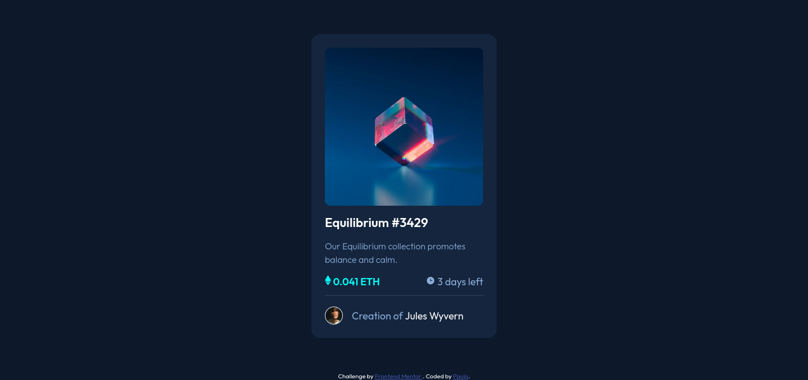
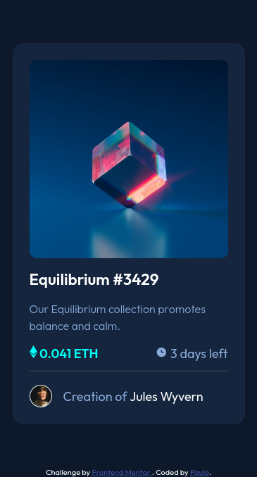

# Frontend Mentor - NFT preview card component solution

This is a solution to the [NFT preview card component challenge on Frontend Mentor](https://www.frontendmentor.io/challenges/nft-preview-card-component-SbdUL_w0U).

## Table of contents

- [Overview](#overview)
  - [The challenge](#the-challenge)
  - [Screenshot](#screenshot)
  - [Links](#links)
- [My process](#my-process)
  - [Built with](#built-with)
  - [What I learned](#what-i-learned)
  - [Continued development](#continued-development)
  - [Useful resources](#useful-resources)
- [Author](#author)
- [Acknowledgments](#acknowledgments)


## Overview

### The challenge

Users should be able to:

- View the optimal layout depending on their device's screen size
- See hover states for interactive elements

### Screenshots






### Links

- Solution URL: [https://www.frontendmentor.io/solutions/nft-preview-card-component-solution-using-html-and-css-with-flexbox-BkDtLM3Nq](https://www.frontendmentor.io/solutions/nft-preview-card-component-solution-using-html-and-css-with-flexbox-BkDtLM3Nq)
- Live Site URL: [https://nft-preview-card-component-wellspr.vercel.app/](https://nft-preview-card-component-wellspr.vercel.app/)

## My process

### Built with

- Semantic HTML5 markup
- CSS custom properties
- Flexbox
- Mobile-first workflow


### What I learned

I made an effort to use semantic HTML5 markup appropriately and make the card accessible to assistive tecnology. 

<!-- Use this section to recap over some of your major learnings while working through this project. Writing these out and providing code samples of areas you want to highlight is a great way to reinforce your own knowledge.

To see how you can add code snippets, see below:

```html
<h1>Some HTML code I'm proud of</h1>
```
```css
.proud-of-this-css {
  color: papayawhip;
}
```
```js
const proudOfThisFunc = () => {
  console.log('🎉')
}
```
-->
<!-- If you want more help with writing markdown, we'd recommend checking out [The Markdown Guide](https://www.markdownguide.org/) to learn more. -->


<!-- ### Continued development

Use this section to outline areas that you want to continue focusing on in future projects. These could be concepts you're still not completely comfortable with or techniques you found useful that you want to refine and perfect.

**Note: Delete this note and the content within this section and replace with your own plans for continued development.** -->

### Useful resources

-[https://stackoverflow.com/questions/8508275/how-to-center-a-position-absolute-element](https://stackoverflow.com/questions/8508275/how-to-center-a-position-absolute-element)
This is a good resorce to help centering an absolute positioned image.

-[https://stackoverflow.com/a/6910112](https://stackoverflow.com/a/6910112) I didn't know how to hover one element and change another, so this link was really handful for this answer.


## Author

- Frontend Mentor - [@wellspr](https://www.frontendmentor.io/profile/wellspr)
- Twitter - [@paulo_wells](https://www.twitter.com/paulo_wells)
